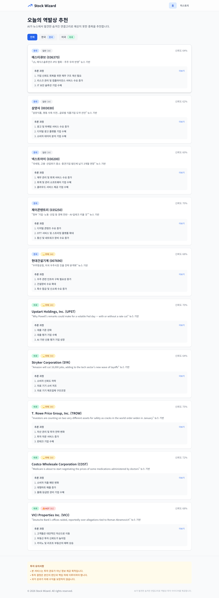
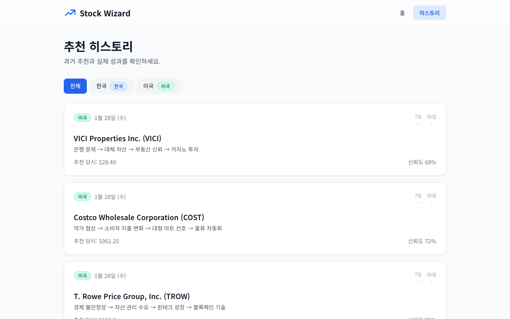

# Stock Wizard

> AI가 뉴스에서 발견한 숨겨진 연결고리로 예상치 못한 종목을 추천합니다.

[](https://vercel.com/new/clone?repository-url=https://github.com/hulryung/stock-wizard)

**Live Demo**: [https://stock-wizard-eta.vercel.app](https://stock-wizard-eta.vercel.app)



## Overview

Stock Wizard는 **역발상 투자 아이디어**를 제공하는 AI 기반 서비스입니다. 

일반적인 주식 추천 서비스가 "반도체 호황 → 반도체 주식"처럼 직접적인 연결을 제시한다면, Stock Wizard는 **4단계 이상의 추론 과정**을 통해 예상치 못한 수혜주를 발굴합니다.

### 역발상 추론 예시

```
뉴스: "메뚜기떼 창궐로 농작물 피해 확산"

일반적 추론: 농업 관련주 하락 예상

역발상 추론:
1. 농작물 피해 → 식량 가격 상승
2. 식량 가격 상승 → 대체 단백질 수요 증가  
3. 대체 단백질 생산 → 자동화 농업 시설 필요
4. 자동화 농업 → 반도체 수요 증가
→ 반도체 기업 추천
```

## Features

- **2단계 분석 파이프라인**: 뉴스 가치 평가 → 역발상 분석
- **뉴스 가치 평가**: market_impact, unexpectedness, contrarian_potential 3축 평가
- **HOT/주목/일반 라벨링**: 뉴스 중요도에 따른 자동 분류
- **한국/미국 시장 지원**: KRX, NYSE, NASDAQ 종목 추천
- **성과 추적**: 7일/30일 후 실제 주가 변동 자동 기록
- **일일 자동 분석**: Vercel Cron으로 매일 오전 6시(KST) 분석 실행



## Tech Stack

| Category | Technology |
|----------|------------|
| Framework | Next.js 14 (App Router) |
| Language | TypeScript |
| Styling | Tailwind CSS |
| AI | OpenAI GPT-4o-mini |
| Database | Supabase (PostgreSQL) |
| Caching | Upstash Redis |
| News API | Finnhub |
| Deployment | Vercel |

## Architecture

```
┌─────────────────────────────────────────────────────────────┐
│                     Vercel Cron (Daily)                     │
└─────────────────────────────────────────────────────────────┘
                              │
                              ▼
┌─────────────────────────────────────────────────────────────┐
│                    News Collection                          │
│              (Finnhub API + Redis Cache)                    │
└─────────────────────────────────────────────────────────────┘
                              │
                              ▼
┌─────────────────────────────────────────────────────────────┐
│              Stage 1: News Value Evaluation                 │
│     (market_impact × unexpectedness × contrarian_potential) │
└─────────────────────────────────────────────────────────────┘
                              │
                              ▼
┌─────────────────────────────────────────────────────────────┐
│              Stage 2: Contrarian Analysis                   │
│           (4+ step reasoning, forbidden patterns)           │
└─────────────────────────────────────────────────────────────┘
                              │
                              ▼
┌─────────────────────────────────────────────────────────────┐
│                    Supabase (PostgreSQL)                    │
│            recommendations + performance_tracking           │
└─────────────────────────────────────────────────────────────┘
```

## Getting Started

### Prerequisites

- Node.js 18+
- pnpm

### Installation

```bash
git clone https://github.com/hulryung/stock-wizard.git
cd stock-wizard
pnpm install
```

### Environment Variables

`.env.example`을 `.env.local`로 복사하고 값을 입력하세요:

```bash
cp .env.example .env.local
```

```env
# Supabase
NEXT_PUBLIC_SUPABASE_URL=your_supabase_url
NEXT_PUBLIC_SUPABASE_ANON_KEY=your_supabase_anon_key
SUPABASE_SERVICE_ROLE_KEY=your_service_role_key

# OpenAI
OPENAI_API_KEY=your_openai_api_key

# Upstash Redis
UPSTASH_REDIS_REST_URL=your_redis_url
UPSTASH_REDIS_REST_TOKEN=your_redis_token

# Finnhub
FINNHUB_API_KEY=your_finnhub_api_key

# Cron Auth
CRON_SECRET=your_cron_secret
```

### Database Setup

Supabase에서 SQL 에디터로 스키마를 실행하세요:

```bash
# supabase/schema.sql 내용을 Supabase SQL Editor에서 실행
```

### Development

```bash
pnpm dev
```

[http://localhost:3000](http://localhost:3000)에서 확인하세요.

### Build & Deploy

```bash
pnpm build
pnpm start
```

또는 Vercel에 직접 배포:

[](https://vercel.com/new/clone?repository-url=https://github.com/hulryung/stock-wizard)

## Project Structure

```
src/
├── app/
│   ├── page.tsx                    # 메인 페이지 (오늘의 추천)
│   ├── history/page.tsx            # 히스토리 페이지
│   └── api/cron/
│       ├── daily-analysis/         # 일일 분석 API
│       └── track-performance/      # 성과 추적 API
├── components/
│   ├── ui/                         # 기본 UI 컴포넌트
│   └── recommendations/            # 추천 카드 컴포넌트
├── lib/
│   ├── prompts/
│   │   ├── contrarian.ts           # 역발상 분석 프롬프트
│   │   └── newsValue.ts            # 뉴스 가치 평가 프롬프트
│   └── services/
│       ├── analysis.ts             # 분석 파이프라인
│       ├── news.ts                 # 뉴스 수집
│       ├── newsEvaluation.ts       # 뉴스 가치 평가
│       └── recommendations.ts      # 추천 CRUD
└── types/
    └── database.ts                 # TypeScript 타입 정의
```

## API Endpoints

| Endpoint | Method | Description |
|----------|--------|-------------|
| `/api/cron/daily-analysis` | GET | 일일 분석 실행 (Cron) |
| `/api/cron/track-performance` | GET | 성과 추적 (Cron) |
| `/api/performance` | GET | 성과 통계 조회 |

## Cron Schedule

`vercel.json`에서 Cron 스케줄을 설정합니다:

```json
{
  "crons": [
    {
      "path": "/api/cron/daily-analysis",
      "schedule": "0 21 * * *"
    },
    {
      "path": "/api/cron/track-performance",
      "schedule": "0 22 * * *"
    }
  ]
}
```

> Note: Vercel Cron은 UTC 기준입니다. 21:00 UTC = 06:00 KST (다음날)

## Contributing

1. Fork the repository
2. Create your feature branch (`git checkout -b feature/amazing-feature`)
3. Commit your changes (`git commit -m 'Add some amazing feature'`)
4. Push to the branch (`git push origin feature/amazing-feature`)
5. Open a Pull Request

## License

MIT License - see [LICENSE](LICENSE) for details.

## Disclaimer

본 서비스는 투자 권유가 아닌 정보 제공 목적입니다. 투자 결정은 본인의 판단과 책임 하에 이루어져야 합니다. 과거 성과가 미래 수익을 보장하지 않습니다.

---

<div align="center">

Made with :heart: by **[HUCONN](https://huconn.com)**

[](mailto:hulryung@gmail.com)
[](https://x.com/hulryung)
[](https://github.com/hulryung/stock-wizard)

</div>
